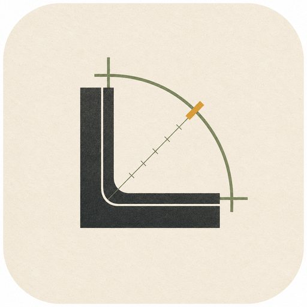

<div align="right"><strong><a href="./README.md">🇬🇧English</a></strong> | <strong>🇨🇳中文</strong></div>

# LumaForge

<p align="center">
  
</p>

<p align="center">
  <strong>在浏览器中，将你喜欢的 LUT 应用到 RAW 照片上。</strong>
</p>

<p align="center">
  拖入一张相机 RAW 文件，本地预览，选择内置风格或声明
  <code>.cube</code> LUT 合约，对比效果，导出全分辨率 JPEG。
</p>

<p align="center">
  <a href="https://luma.ichr.me/raw"><strong>打开 RAW 实验室</strong></a>
  ·
  <a href="https://luma.ichr.me">产品页面</a>
  ·
  <a href="./docs/README_zh.md">帮助</a>
  ·
  <a href="#本地开发">本地运行</a>
  ·
  <a href="#架构">架构</a>
</p>

<p align="center">
  <a href="https://github.com/chralpha/lumaforge/actions/workflows/build.yml">
    
  </a>
  <a href="./LICENSE">
    
  </a>
  
  
</p>

## 承诺

许多摄影师已经有了自己喜爱的 LUT：相机风格、胶片配方、电影质感，或是
精心收藏的 `.cube` 文件。LumaForge 让 RAW 照片也能用上这套工作流，
你不必事先把色域、对数曲线、信号范围和输出变换研究透彻。

产品聚焦于一条清晰的路径：

```text
单张 RAW 文件 -> 预览 -> 风格或 LUT -> 对比 -> JPEG 导出
```

源图像留在你的设备上，应用将 LUT 所需的色彩细节转化为引导式合约选择，
你只需专注于出片。

## 用起来很简单

| 用户想要什么                   | LumaForge 如何帮助                                                                           |
| ------------------------------ | -------------------------------------------------------------------------------------------- |
| 在 RAW 照片上尝试喜欢的 LUT。  | 用直观的标签搜索或选择 LUT 的输入和输出配置文件。                                            |
| 快速看到图像。                 | 依次提供嵌入式预览、快速预览和受控高品质预览。                                             |
| 保护照片隐私。                 | 在浏览器本地处理所选文件。                                                                   |
| 无需繁琐设置即可完成一张照片。 | 无需账户、上传、原生助手和许可证管理。                                                       |
| 自信地导出。                   | 当源文件和合约受支持时，通过 Worker 路径重建全分辨率 JPEG。                                  |

专业工具如 Lightroom、Capture One 和 DaVinci Resolve 在需要完整编辑控制、
目录管理、节点图或专业级调色自由度时仍然是出色的选择。LumaForge
选择了一条更小巧、更友好的路线——当你只想用自己喜欢的风格将一张 RAW
文件变成一张完成的 JPEG 时。

## 能做什么

- 从常见相机格式（如 ARW、NEF、RAF、RW2、ORF、DNG、CR2、CR3、PEF、SRW、
  IIQ、3FR、FFF 及相关 RAW 扩展名）本地加载单张 RAW 文件。
- 通过嵌入式预览、快速预览和受控高品质预览逐步看到图像。
- 使用 WebGL2 预览渲染器对比原始和处理后的输出。
- 选择内置风格：Neutral、Warm、Cool、Film Soft、Film Contrast、Cinematic、
  Fade 和 Mono。
- 调整轻度润色控制（如曝光、对比度和风格强度），而不会把应用变成完整的
  显影驾驶舱。
- 上传自定义 `.cube` LUT 并声明其输入和输出合约。
- 处理各种配置文件系列，如 ARRI LogC、RED Log3G10、Sony S-Log、Panasonic
  V-Log、Fujifilm F-Log、Canon Log、Nikon N-Log、ACES 和显示 sRGB。
- 通过受控 Worker 路径导出全分辨率 JPEG，浏览器支持时提供下载、分享和
  剪贴板操作。

## LUT 合约

色彩路径在最终 JPEG 输出之前保持场景参考（scene-referred）：

```text
RAW 文件
-> @lumaforge/luma-raw-runtime
-> 元数据、嵌入式预览、快速/HQ 解码、导出能力信息
-> Linear ProPhoto 场景参考工作图像
-> LUT 输入色域和传递/对数编码
-> 内置风格或声明的 .cube LUT
-> 声明的 LUT 输出变换
-> Rec.709/sRGB JPEG 输出
```

LUT 合约是一小段结构，让 LumaForge 能够将创意风格应用于 RAW
文件，而无需用户手动构建色彩管线。当 LUT 本身携带有用元数据时，
LumaForge 可以直接使用。当需要更多信息时，应用会通过可搜索的
合约浏览器询问 LUT 的输入和输出配置文件。

如果所选源文件或 LUT 合约尚不受全分辨率导出路径支持，LumaForge
会说明缺少什么，并在最终 JPEG 能够由正式 Worker 导出路径复现之前
阻止导出。

## 产品边界

LumaForge 是一套运行在浏览器中的 RAW + LUT 处理管线。当前支持的运行环境是
配备 WebGL2 的现代桌面浏览器。移动端浏览器、不常见的 RAW 布局，以及无法暴露所需处理窗口信息的文件
可能被标记为实验性或不受支持。

产品有意不包含：

- 要求云端上传；
- 账户或项目目录；
- 批量处理；
- 本地守护进程或原生助手；
- 完整的桌面风格 RAW 显影面板；
- AI 降噪、遮罩、镜头校正或无限制的调整堆叠。

## 架构

应用围绕产品承诺的边界划分：交互式预览和全分辨率导出共享色彩管线意图，
但它们不是同一个执行器。

- `packages/luma-raw-runtime`：浏览器 RAW 元数据、预览提取、解码会话、
  处理窗口访问、导出能力信息，以及锁定的原生构建产物。
- `packages/luma-color-runtime`：纯 TypeScript 色彩运算、LUT 合约、
  传递函数/色域变换、图谱解析、行处理和 GLSL 辅助函数。
- `packages/luma-jpeg-runtime`：受控的逐行 JPEG 编码器。
- `src/lib/gl`：WebGL2 交互式预览渲染。
- `src/lib/export`：Worker 驱动的全分辨率导出路径。
- `src/modules/raw-processor`：`/raw` 工作流，涵盖上传、预览、风格选择、
  LUT 合约选择、对比、状态和导出操作。

## 本地开发

环境要求：

- 与仓库工具链兼容的 Node.js
- pnpm 10.18.0
- 支持 WebGL2 的现代桌面浏览器

安装依赖：

```bash
pnpm install
```

启动开发服务器：

```bash
pnpm dev
```

打开：

```text
http://localhost:5173/raw
```

常用检查：

```bash
pnpm lint
pnpm test:run
pnpm build
```

本仓库仅使用 `pnpm`。

## 原生运行时

RAW 和 JPEG 运行时是工作区包。它们的原生输入已锁定版本，从记录来源构建。
应用不应依赖 `libraw-wasm`、`LibRaw-Wasm` 或本地基线构建产物路径；
当前的 RAW 边界是 `@lumaforge/luma-raw-runtime`。

生产构建在原生文件可用时优先使用预构建的 `@lumaforge/luma-native-artifacts`
包。开发服务默认使用工作区源构建产物。通过 `LUMAFORGE_NATIVE_RUNTIME_MODE`
覆盖选择：

- `auto`：优先使用预构建产物，然后回退到工作区产物。
- `prebuilt`：要求使用 `@lumaforge/luma-native-artifacts` 产物。
- `source`：要求使用工作区 `packages/*/dist/native` 产物。

原生相关命令：

```bash
pnpm native:prepare
pnpm native:build
pnpm native:verify
pnpm --filter @lumaforge/luma-raw-runtime test
```

发布更新的原生产物前：

```bash
pnpm native:build
pnpm native:verify
pnpm native:artifacts:sync
pnpm native:artifacts:verify
pnpm native:artifacts:pack
```

获取公开 RAW 冒烟测试样本：

```bash
pnpm --filter @lumaforge/luma-raw-runtime fixtures:fetch-public
```

## 贡献

保持贡献与产品边界一致：一张 RAW 文件、本地预览、风格或 LUT、对比和
可信赖的 JPEG 导出。色彩和 LUT 更改应保持合约清晰：声明的输入色域、
传递/对数曲线、LUT 角色、输出处理和导出就绪行为应对用户保持透明。

## 许可证

LumaForge 基于 GPL-3.0 分发。详见 [LICENSE](./LICENSE)。

RAW 和原生构建产物包携带针对 LibRaw、Little CMS、libjpeg-turbo 和锁定
Emscripten 工具链的第三方许可声明。在重新分发原生产物之前，请参阅
[packages/luma-raw-runtime/THIRD_PARTY_NOTICES.md](./packages/luma-raw-runtime/THIRD_PARTY_NOTICES.md)。
