# RAW Color Pipeline: Color-Science Rationale and LumaForge Audit

Date: 2026-04-24

Scope: this document explains, from a color-science perspective, why a cross-camera RAW pipeline should normalize camera-dependent sensor data into a standard scene-linear space before applying a creative LUT. It also audits the current LumaForge RAW runtime, WebGL preview path, log encodings, LUT handling, and export boundaries.

## 1. Executive Summary

A rigorous cross-brand RAW creative-LUT pipeline should be:

```text
Camera RAW
  -> RAW technical development
  -> standard scene-linear space
  -> LUT-declared target gamut / log encoding
  -> creative look
  -> output transform
  -> display or delivery encoding
```

The goal is not to turn every camera RAW file into another camera brand's RAW. The goal is to convert device-dependent sensor responses into a clearly defined scene-referred linear representation using camera profiles, IDTs, color correction matrices, white balance, exposure normalization, black/white-level handling, and linearization. The image can then be transformed into the exact gamut and transfer function expected by the creative LUT.

This model is consistent with official ACES, ICC, DNG, ARRI LogC4/AWG4, RED IPP2/RWG/Log3G10, Panasonic V-Log/V-Gamut, and LibRaw documentation:

- ACES Input Transforms convert camera-specific image data into ACES relative exposure values before look and output transforms are applied.[^aces-idt]
- ICC profiles use a Profile Connection Space (PCS) to decouple device-dependent inputs from device-dependent outputs.[^icc-pcs]
- The DNG specification defines matrix paths from white-balanced camera colors into CIE XYZ D50.[^dng-forward]
- ARRI defines LogC4 as a scene-referred logarithmic color space composed of the LogC4 curve and ARRI Wide Gamut 4 primaries.[^arri-logc4]
- RED IPP2 places creative LUTs in the RWG/Log3G10 grading stage, before the output transform.[^red-ipp2-stages]
- Panasonic V-Log/V-Gamut documentation defines an explicit wide-gamut camera space and V-Log transfer function, including matrix conversion to BT.709.[^panasonic-vlog]

LumaForge's current implementation is best described as:

```text
Phase 1: technically stable Linear ProPhoto RGB decode + display-referred style preview
Not yet: full ACES/OCIO-grade scene-referred LUT interchange pipeline
```

The current RAW runtime and adapter are directionally correct for a browser-local Phase 1 pipeline: LibRaw is configured for 16-bit, linear gamma, no auto-brightening, ProPhoto output, and the adapter labels the result as `linear-prophoto-rgb`. The WebGL shader converts Linear ProPhoto RGB to display sRGB and applies built-in styles or custom LUTs. That is a valid preview architecture, but it is not equivalent to a professional scene-linear target-log/gamut LUT pipeline.

During this audit, the ARRI LogC4 implementation in `src/lib/color/log-encoding.ts` was found to be incorrect and was fixed against ARRI's published constants and reference behavior. A focused regression test was added.

## 2. Recommended Standard Pipeline

```mermaid
flowchart LR
  A[Camera RAW] --> B[Linearization / black-white level / demosaic]
  B --> C[Exposure and white-balance alignment]
  C --> D[Camera profile / IDT / CCM]
  D --> E[Scene-linear standard space<br/>ACES2065-1 / XYZ D50 / Linear ProPhoto]
  E --> F[Target gamut transform<br/>AWG4 / RWG / AP1 / V-Gamut]
  F --> G[Target log encoding<br/>LogC4 / Log3G10 / ACEScct / V-Log]
  G --> H[Creative LUT / CLF / LMT]
  H --> I[Output transform<br/>tone map + gamut map]
  I --> J[Rec.709 / P3 / Rec.2020 / HDR]
```



Key constraints:

- Matrix operations, white balance, and camera profiles must operate on linear data.
- Every LUT must either declare its input gamut, input transfer function, output semantics, and intended domain, or require explicit user selection of those properties.
- Creative LUTs and output transforms should be separated. If a `.cube` LUT contains both the look and a Rec.709 output transform, it should be treated as a combined/output LUT, not as a pure scene-referred creative LUT.
- Output transforms must define display primaries, white point, EOTF, viewing assumptions, tone mapping, and gamut mapping.
- A LUT input contract never implies the LUT output contract. For example, a LUT that expects V-Gamut/V-Log input may output V-Log, scene-linear values, or a display-referred Rec.709 image. The output gamut, transfer, range, and role must be declared independently or selected explicitly.
- Filename, title, and free-form comments are not color-science authority. They may be shown as hints in the UI, but rendering/export decisions must come from structured trusted metadata or explicit user selection. A persisted user-selected contract may be reapplied by stable LUT content identity, but the content identity is not authority by itself.
- LumaForge's current browser photo export target is Rec.709/sRGB. Technical or combined LUTs that already output Rec.709/display-encoded values must be decoded according to the declared output transfer before final sRGB encoding, rather than receiving another display gamma pass.
- LibRaw's strict 16-bit Linear ProPhoto output is a technical scene-linear handoff, not a complete default photo rendering. Camera/system previews normally include exposure normalization, a tone curve, and vendor style choices. LumaForge must add its own explicit, deterministic RAW render exposure stage instead of enabling LibRaw auto-brightening or display gamma in the scene-referred core.

## 3. Color-Science Basis

### 3.1 RAW Is Device-Dependent Sensor Data

RAW is not a standard color value. A simplified camera response model is:

```text
R_camera = integral E(lambda) * S_R(lambda) d(lambda)
G_camera = integral E(lambda) * S_G(lambda) d(lambda)
B_camera = integral E(lambda) * S_B(lambda) d(lambda)
```

Where `E(lambda)` is the scene spectral power distribution and `S_R/G/B(lambda)` are the effective spectral sensitivities produced by the sensor, CFA filters, IR-cut filter, microlenses, optical stack, and lens transmission.

Two cameras can see the same physical scene and produce different RAW triplets because their spectral sensitivities differ. Those triplets are device-dependent measurements. They must be interpreted by a profile, IDT, or matrix before they can be treated as standard color values.

The DNG specification models this explicitly. It describes RAW processing steps such as linearization, black subtraction, rescaling, clipping, and color-space conversion. Its `ForwardMatrix` tag is defined as a matrix that maps white-balanced camera colors to XYZ D50, and Chapter 6 gives the camera-to-XYZ D50 computation path.[^dng-forward]

### 3.2 ACES: Input Transforms Normalize Before Looks

ACES Input Transforms are responsible for converting an image captured or encoded in a source-specific way into ACES image data. The ACES Input Transform documentation lists responsibilities such as linearization, white balancing, clipping, color analysis, and neutral chromaticity difference compensation.[^aces-idt]

ACES Look Transforms are ACES-to-ACES transforms: they take ACES2065-1 RGB relative exposure values as input and output ACES2065-1 RGB relative exposure values. They may use another working space internally, but the interchange contract remains ACES.[^aces-look]

ACES Output Transforms then convert scene-referred ACES image data into display-referred output for a target display and viewing condition.[^aces-output]

The important architecture is:

```text
Input Transform / IDT
  -> ACES2065-1 scene-linear interchange
  -> Look Transform / LMT
  -> Output Transform / ODT
```

This is directly equivalent to:

```text
Camera RAW / native RGB
  -> standard scene-linear space
  -> creative look
  -> display or delivery output
```

### 3.3 ICC PCS: Device Spaces Are Connected Through a Standard Interface

The ICC profile architecture uses a Profile Connection Space as the standard interface between profiles. Input, display, and output transforms can be paired predictably through that PCS rather than being directly hard-coded to each other.[^icc-pcs]

For RAW processing, the same idea appears as:

```text
Camera RAW / camera RGB
  -> input profile / IDT
  -> standard connection space such as XYZ or ACES
  -> target working or output profile
```

The industry precedent is clear: color management does not rely on one device's native values being universal. It relies on explicit transformations into a known connection space.

### 3.4 ARRI LogC4/AWG4: A LUT Input Is a Gamut + Transfer Contract

ARRI's LogC4 specification defines LogC4 as a scene-referred logarithmic color space consisting of the LogC4 transfer function and ARRI Wide Gamut 4 primaries. The specification publishes the AWG4 chromaticities, D65 white point, RGB-to-XYZ matrices, and LogC4 transfer constants.[^arri-logc4]

Therefore, a LUT designed for LogC4/AWG4 expects this input:

```text
scene-linear source
  -> AWG4 linear RGB
  -> LogC4 encoding
  -> LUT
```

It should not be fed Rec.709, display sRGB, Linear ProPhoto, camera-native RGB, or a RAW preview unless that preview has first been transformed into AWG4 and encoded with LogC4.

### 3.5 RED IPP2: Creative LUTs Sit in RWG/Log3G10

RED IPP2 separates image processing into three stages:

```text
Primary Raw Development
  -> Grading
  -> Output Transform
```

Primary Raw Development converts camera data into REDWideGamutRGB and encodes it with Log3G10. Grading operations, including ASC CDL and Creative 3D LUTs, are performed in RWG/Log3G10. The Output Transform then performs tone mapping, gamut mapping, highlight handling, and final output color/gamma conversion.[^red-ipp2-stages]

RED's IPP2 LUT white paper further distinguishes Creative, Output Transform, and Combined LUTs, and states that LUTs in IPP2 are applied to RWG/Log3G10 data.[^red-cube-lut]

This reinforces the same rule: creative LUTs are not universal image filters. They are functions defined over a specific numeric encoding.

### 3.6 Panasonic V-Log/V-Gamut: Camera Log Also Has Explicit Math

Panasonic's V-Log/V-Gamut reference manual defines V-Gamut primaries, D65 white, matrices to and from BT.709, and the V-Log transfer function.[^panasonic-vlog]

That means a V-Log LUT also has a precise expected input:

```text
scene-linear source
  -> V-Gamut linear RGB
  -> V-Log encoding
  -> LUT
```

A display-sRGB-to-V-Log approximation can be useful for preview compatibility, but it is not colorimetrically equivalent to a camera/scene-linear transform into V-Gamut followed by V-Log.

## 4. Mathematical Model

### 4.1 Camera RGB to XYZ or Standard Linear RGB

After black-level subtraction, white-level normalization, demosaic, white balance, and exposure alignment, a 3x3 matrix can approximate conversion from camera RGB to a standard linear space:

```text
XYZ_D50 = M_forward * RGB_camera_wb_linear
```

Or:

```text
ACES_linear = M_IDT * RGB_camera_wb_linear
```

The matrix can be estimated from measured chart patches:

```text
M = transpose(inv(transpose(RGB) * RGB) * transpose(RGB) * XYZ)
```

In practice, a perceptual objective such as minimizing Delta E may be preferable to raw XYZ least-squares error, depending on the profiling goal. The important constraint is that the matrix operates on linear RGB values. Applying a 3x3 color correction matrix after gamma encoding, log encoding, or tone mapping breaks the linear model.

### 4.2 From Standard Linear to Target Log/Gamut

If the normalized source is `RGB_standard_linear`, and the LUT expects ARRI LogC4/AWG4:

```text
RGB_standard_linear
  -> RGB_AWG4_linear
  -> LogC4(RGB_AWG4_linear)
  -> LUT
```

If the LUT expects REDWideGamutRGB/Log3G10:

```text
RGB_standard_linear
  -> RGB_RWG_linear
  -> Log3G10(RGB_RWG_linear)
  -> LUT
```

If the LUT expects ACEScct/AP1:

```text
RGB_standard_linear
  -> RGB_AP1_linear
  -> ACEScct(RGB_AP1_linear)
  -> LUT
```

The LUT input must match the space for which the LUT was authored. Matching only the visual "look" of a camera brand is not enough.

### 4.3 Why One LUT Can Work Across Cameras After Normalization

A LUT is a function:

```text
Y = LUT(X)
```

If two cameras are normalized into the same scene-linear standard space and then transformed into the LUT's declared input encoding, their LUT inputs should have the same semantic meaning:

```text
Camera A RAW -> Standard Linear -> Target Log/Gamut -> X_A
Camera B RAW -> Standard Linear -> Target Log/Gamut -> X_B
```

Under matched exposure, white balance, profiles, and illumination assumptions:

```text
X_A ~= X_B
```

Therefore:

```text
LUT(X_A) ~= LUT(X_B)
```

The residual differences are not magic. They come from sensor spectral mismatch, profile error, metamerism, clipping, lens transmission, noise, flare, demosaic differences, and vendor-side hidden processing.

## 5. Boundaries and Failure Modes

### 5.1 Luther Condition and Metamerism

A camera would be strictly colorimetric if its sensor sensitivities were a linear transform of the CIE color matching functions, commonly discussed as the Luther condition or Maxwell-Ives criterion. Real cameras only approximate this condition.[^luther-limit]

This matters because two scenes with the same human-observer tristimulus values can produce different camera RGB values if the camera sensitivities do not match the observer functions. It also means two cameras can disagree under narrowband or unusual spectra even when both have high-quality profiles.

Expected residual-risk cases include:

- RGB LED, laser, fluorescent, stage, and mixed-spectrum lighting.
- Highly saturated pigments, blue/purple fabrics, fluorescent materials, neon signs, vegetation, metals, jewels, and special coatings.
- Channel clipping, especially in saturated red, blue, or highlight regions.
- Incorrect or low-quality camera profiles.
- Profiles captured under a different illuminant than the production scene.
- RAW-like formats that already include hidden denoising, highlight reconstruction, gamut clipping, local tone mapping, or vendor looks.

The rigorous claim is not "all cameras become identical." The rigorous claim is:

```text
Standardized color management greatly reduces cross-camera differences into
measurable, explainable, and manageable residuals.
```

### 5.2 Brand Color Is Usually a Mixture of Physics and Rendering

Camera-brand color can be separated into two broad components:

1. Physical capture differences: sensor spectral sensitivities, CFA filters, IR-cut filters, microlenses, lens transmission, flare, dynamic range, clipping, and noise.
2. Rendering choices: JPEG tone curves, hue twists, saturation mapping, skin-tone protection, highlight roll-off, local contrast, default white balance, preview profiles, and film simulations.

The rendering component is highly transferable through profiles, tone curves, 3D LUTs, CLF/CTL transforms, or an ACES LMT. The physical spectral component can be modeled and reduced, but not perfectly eliminated for all possible spectra.

## 6. LumaForge Implementation Audit

### 6.1 RAW Runtime Decode Path

Relevant files:

- `packages/luma-raw-runtime/worker/runtime-core.ts`
- `packages/luma-raw-runtime/native/libraw_wrapper.cpp`
- `src/lib/raw/luma-runtime-adapter.ts`

The runtime's quick settings use:

```ts
{
  halfSize: true,
  useCameraWb: true,
  outputColor: 4,
  outputBps: 16,
  noAutoBright: true,
  userQual: 0,
  gamm: [1, 1, 1, 1, 0, 0],
}
```

High-quality preview switches to full size and higher demosaic quality:

```ts
{
  halfSize: false,
  userQual: 2,
}
```

The native wrapper passes these settings into LibRaw before `unpack()` and `dcraw_process()`, then exports an RGB16 bitmap. The adapter maps the result to:

```ts
layout: 'rgb-u16'
colorSpace: 'linear-prophoto-rgb'
```

Audit result:

- `outputBps: 16` is correct for preserving precision.
- `gamm: [1, 1, 1, 1, 0, 0]` is the right intent for linear output.
- `noAutoBright: true` is important because automatic brightening would damage scene/exposure semantics.
- `outputColor: 4` is LibRaw's ProPhoto output path, which matches the adapter label.
- `useCameraWb: true` is reasonable for Phase 1 preview, but future color-critical workflows should allow explicit illuminant/profile control instead of always trusting as-shot or camera WB.
- `halfSize: true` in quick preview is acceptable for speed, while high-quality mode uses full size.
- This setting intentionally bypasses LibRaw's output-stage auto-brightening and display gamma behavior. LibRaw discussions describe auto-ETTR/auto-brightening as output-stage behavior during conversion from linear internal representation to gamma-corrected output, and manual brightness control as a separate output parameter path.[^libraw-auto-ettr][^libraw-manual-brightness] Therefore, matching a system RAW preview requires a later explicit render-exposure decision, not changing the LibRaw handoff away from linear scene data.

This path is technically coherent for:

```text
Camera RAW -> LibRaw RGB16 Linear ProPhoto -> browser preview
```

It should not yet be marketed as a camera-specific IDT or full ACES input pipeline.

### 6.2 Default RAW Render Exposure

The current linear handoff can look darker than operating-system RAW previews because those previews are display renderings, not neutral scene-linear values. They often come from an embedded JPEG or from a vendor/system RAW renderer that has already applied exposure normalization, picture-style tone curves, local contrast, highlight handling, and display encoding. A linear ProPhoto buffer with LibRaw auto-brightening disabled should preserve scene ratios, but it is not expected to have the same midtone placement as a camera JPEG.

The corrected LumaForge pipeline should keep LibRaw configured for deterministic Linear ProPhoto, then insert an explicit render-exposure stage owned by LumaForge:

```text
LibRaw RGB16 Linear ProPhoto
  -> deterministic RAW render exposure multiplier
  -> LUT input gamut / transfer preparation
  -> LUT or built-in style
  -> declared LUT output handling
  -> Rec.709/sRGB photo output
```

Requirements:

- Do not turn off `noAutoBright` or switch LibRaw `gamm` back to display gamma in the scene-referred path. That would make preview/export depend on LibRaw output heuristics and would contaminate camera-log LUT input preparation.
- Prefer structured RAW metadata when it exists. For DNG, LibRaw exposes `imgdata.color.dng_levels.baseline_exposure`; DNG readers and LibRaw discussions use baseline exposure as an explicit scale needed to make DNG intensities comparable across files.[^libraw-baseline-exposure]
- For files without reliable baseline exposure, compute one deterministic fallback exposure from the opened image, using a downsampled or preview-sized luminance statistic. The result must be stored with the decoded RAW session and reused by preview and full-resolution export. It must not be recomputed independently per export strip.
- The render exposure is a scene-linear multiplier applied before LUT input gamut/log encoding. This aligns the RAW image into a practical default display/render domain while preserving the LUT contract.
- Any future tone curve or highlight rolloff must be a named LumaForge render-intent step with preview/export parity. It must not be hidden inside LibRaw settings or inferred from the file name.

Audit result:

- The current strict LibRaw settings are still correct for the color-science handoff.
- The observed dark appearance is an expected missing render-intent stage, not evidence that the LUT input/output contract design is wrong.
- The next implementation should add a small, explicit default exposure resolver before broadening into a full photographic tone-mapping pipeline.

### 6.3 Display Transform and Built-In Looks

Relevant files:

- `src/lib/gl/shaders.ts`
- `src/lib/color/matrix.ts`
- `src/lib/color/constants.ts`

The fragment shader converts U16 Linear ProPhoto RGB D50 into display sRGB D65 using a linear matrix path, then applies the selected look and encodes to sRGB for display.

Audit result:

- Linear ProPhoto to sRGB display conversion is the correct conceptual direction for a browser preview.
- Built-in looks currently operate after conversion to display sRGB semantics. They are display-referred style looks, not scene-referred ACES LMTs.
- This is acceptable for a Phase 1 local editor if the UI language and documentation do not imply full color-managed finishing.

### 6.4 Custom LUT Path

Relevant files:

- `src/lib/gl/shaders.ts`
- `src/lib/lut/cube-parser.ts`

Historical audit note: this section describes the Phase 1 behavior observed on
2026-04-24. It is superseded by the
[`2026-04-27 LUT output contract correction plan`](../plans/2026-04-27-phase2-lut-output-contract-correction-plan.md)
and the current implementation. Filename, title, and free-form comments are no
longer authority for render/export contracts; they may only produce suggestions.
Current resolution requires structured metadata, an explicit user-selected full
contract, or a persisted user-selected contract keyed by content fingerprint.

At the time, the parser supported:

```ts
type LUTInputProfile = 'display-srgb' | 'v-log'
```

In the historical Phase 1 path, `v-log` was inferred from LUT comments/title/name. In that shader path, V-Log LUT preparation started from display color:

```text
Linear ProPhoto
  -> display sRGB
  -> sRGB decode
  -> Rec.709 linear to V-Gamut linear approximation
  -> V-Log encoding
  -> LUT
```

Audit result:

- This was useful as a best-effort compatibility path for LUTs named like V-Log LUTs, but it is not the current contract-resolution rule.
- It is not equivalent to the rigorous path:

```text
Linear ProPhoto scene data
  -> target scene-linear gamut
  -> target log encoding
  -> LUT
  -> output transform
```

- The historical path could not correctly support LogC4/AWG4, RWG/Log3G10, ACEScct/AP1, camera-native log spaces, or LUTs that include their own output transform unless metadata was added.
- Current browser photo export remains Rec.709/sRGB. For combined or technical LUTs, the LUT output must be decoded from its declared output transfer before the final sRGB export encode.

Required next step:

```ts
interface LUTColorProfile {
  role: 'creative-scene' | 'display-look' | 'output-transform' | 'combined'
  inputGamut:
    | 'display-srgb'
    | 'rec709'
    | 'v-gamut'
    | 'awg4'
    | 'rwg'
    | 'aces-ap1'
    | 'custom'
  inputTransfer:
    | 'linear'
    | 'srgb'
    | 'gamma24'
    | 'v-log'
    | 'logc4'
    | 'log3g10'
    | 'acescct'
    | 'custom'
  outputGamut?: LUTColorProfile['inputGamut']
  outputTransfer?: LUTColorProfile['inputTransfer']
  domainMin?: [number, number, number]
  domainMax?: [number, number, number]
}
```

Then the shader pipeline can branch cleanly:

```text
Scene-referred creative LUT:
  Linear ProPhoto
    -> target gamut linear
    -> target log
    -> LUT
    -> inverse/declared output handling
    -> display transform

Display-referred LUT:
  Linear ProPhoto
    -> display sRGB
    -> LUT
```

### 6.5 Log Encoding Functions

Relevant file:

- `src/lib/color/log-encoding.ts`

Audit result:

- Panasonic V-Log and RED Log3G10 functions are structurally aligned with their published piecewise/log formulas.
- ARRI LogC4 was incorrect before this audit. It encoded linear zero to `-Infinity` and encoded 18% gray far above the expected LogC4 value.
- The implementation has been replaced with ARRI's published constants and piecewise CTL-style form.
- Regression tests now cover:
  - `logC4Encode(0) ~= 95 / 1023`
  - `logC4Encode(0.18) ~= 0.2783958365482653`
  - `logC4Encode(469.8) ~= 1`
  - `logC4Decode(0) ~= -0.01805699611991131`
  - `logC4Decode(95 / 1023) ~= 0`
  - `logC4Decode(1) ~= 469.8`

This matters even though LogC4 is not yet wired into the custom LUT path. Incorrect log math would make any future LogC4/AWG4 LUT support unusable.

### 6.6 Export Path

Relevant files:

- `src/lib/gl/export.ts`
- `src/lib/raw/pipeline.ts`

The export path renders through the same WebGL transform and reads back an 8-bit RGBA canvas buffer.

Audit result:

- This is acceptable for browser preview/export workflows.
- It is not suitable for high-end grading interchange, scene-linear EXR export, or HDR mastering.
- Future professional export should preserve a higher-precision path, ideally 16-bit TIFF or EXR, with explicit color-space metadata and output-transform selection.

## 7. Recommended Roadmap

### 7.1 Documentation and UI Labeling

Use precise labels:

```text
Current:
  RAW preview pipeline
  Linear ProPhoto internal decode
  display-referred style preview
  best-effort V-Log LUT compatibility

Avoid:
  ACES-compatible
  camera-matching IDT
  LogC4/RWG/ACEScct LUT support
  color-managed finishing
```

### 7.2 LUT Metadata and Import Controls

Add explicit LUT metadata instead of relying on filename inference:

- Input gamut.
- Input transfer function.
- Output gamut and transfer, if known.
- LUT role: creative, display look, output transform, or combined.
- Domain min/max.
- Whether the LUT expects legal/video range or full range.
- Metadata source: structured trusted metadata, explicit user selection, or a persisted user-selected contract keyed by stable LUT content identity. Filename, title, and comment strings may populate suggestions only; they must not silently resolve the render/export profile.
- Whether the output contract is complete. Same-space creative output must still be explicit by setting the output gamut, transfer, and range equal to the input side. Otherwise preview and export should fail closed until the output contract is known.
- Whether the LUT expects scene-referred or display-referred values.

### 7.3 Default RAW Render Exposure

Add an explicit default RAW render exposure resolver before scene-referred LUT preparation:

- Use DNG `baseline_exposure` when LibRaw exposes a finite value.
- Otherwise estimate a stable EV offset from a downsampled Linear ProPhoto luminance statistic.
- Clamp the automatic EV range to avoid hiding badly underexposed/overexposed captures.
- Persist the resolved EV in the decoded image/session state and pass it into both WebGL preview and full-resolution export graph construction.
- Apply the multiplier before `gamut-to-lut-input` and before no-LUT display conversion.
- Surface the source in telemetry: `dng-baseline`, `image-statistics`, `user`, or `identity`.
- Keep manual user exposure adjustment as a separate additive EV on top of the automatic base; do not bake it into LibRaw settings.

This is the minimum step needed to make the strict Linear ProPhoto handoff visually usable while preserving scene-referred LUT correctness.

### 7.4 Scene-Referred LUT Branch

Add a second shader path for scene-referred creative LUTs:

```text
Linear ProPhoto RGB D50
  -> chromatic adaptation if needed
  -> target linear gamut
  -> target log transfer
  -> LUT
  -> output interpretation
  -> display transform
```

At minimum, useful targets would be:

- V-Gamut / V-Log
- AWG4 / LogC4
- RWG / Log3G10
- ACES AP1 / ACEScct

### 7.5 ACES / OCIO Option

For a professional pipeline, add an OCIO-backed or ACES-compatible transform graph rather than hard-coding every conversion in GLSL. The local shader path can remain for fast browser preview, but the transform graph should become declarative and testable.

### 7.6 Validation Assets

Add golden-image and numeric validation using:

- Neutral ramp.
- Saturation sweep.
- Macbeth/ColorChecker synthetic references.
- Known LogC4, Log3G10, V-Log, and ACEScct reference points.
- Round-trip tests for RGB primary matrices and log encodings.
- RAW render exposure tests covering DNG baseline exposure, non-DNG statistical fallback, preview/export parity, and export-strip consistency.

## 8. Final Conclusion

The color-science conclusion is:

```text
RAW
  -> standard scene-linear space
  -> target log/gamut
  -> creative LUT
  -> output transform
```

is a rigorous, industry-aligned pipeline. It matches the architecture of ACES Input/Look/Output Transforms, ICC PCS-based color management, DNG camera-to-XYZ profiling, ARRI LogC4/AWG4, RED IPP2 RWG/Log3G10, and Panasonic V-Log/V-Gamut.

The correct statement is not that every camera becomes perfectly identical. Real sensors do not perfectly satisfy the Luther condition, and spectral metamerism, clipping, profile error, lens transmission, hidden vendor processing, and dynamic range differences remain. The correct statement is:

```text
With correct exposure alignment, white balance, input profiles/IDTs, target
log/gamut conversion, and output transforms, cross-brand RAW images can be
normalized into the same color semantics before a creative LUT is applied.
The remaining differences are explainable residuals, not unrepeatable brand magic.
```

As of the original 2026-04-24 audit, LumaForge was correct for its Phase 1 preview scope. The RAW runtime produced a coherent Linear ProPhoto RGB input, and the WebGL preview path performed a reasonable display transform. The successor 2026-04-27 LUT correction makes the custom LUT contract boundary stricter: non-display LUTs require declared input and output contracts, filename/title/free-form comments are suggestions only, and final browser photo export remains Rec.709/sRGB with declared LUT output transfer decoding before final sRGB encoding. The 2026-04-27 render-exposure correction adds one more boundary: LibRaw strict linear output remains the handoff, but LumaForge needs an explicit default RAW render exposure stage so neutral scene-linear values are not mistaken for a finished system-style RAW preview.

## References

[^aces-idt]: ACES Documentation, "Input Transforms." <https://docs.acescentral.com/system-components/input-transforms/>

[^aces-look]: ACES Documentation, "Look Transform Specification." <https://docs.acescentral.com/system-components/look-transforms/specification/>

[^aces-output]: ACES Documentation, "Output Transforms." <https://docs.acescentral.com/system-components/output-transforms/>

[^aces-amf]: ACES Documentation, "ACES Metadata File Specification." <https://docs.acescentral.com/amf/specification/>

[^icc-pcs]: International Color Consortium, "Introduction to the ICC profile format." <https://www.color.org/iccprofile.xalter>

[^dng-forward]: Adobe, "Digital Negative (DNG) Specification, Version 1.7.1.0." <https://helpx.adobe.com/content/dam/help/en/camera-raw/digital-negative/jcr_content/root/content/flex/items/position/position-par/download_section_733958301/download-1/DNG_Spec_1_7_1_0.pdf>

[^arri-logc4]: ARRI, "ARRI LogC4 Logarithmic Color Space Specification." <https://www.arri.com/resource/blob/278790/bea879ac0d041a925bed27a096ab3ec2/2022-05-arri-logc4-specification-data.pdf>

[^red-ipp2-stages]: RED, "IPP2 Image Pipeline Stages." <https://docs.red.com/915-0190/915-0190%20Rev-D%20%20%20RED%20OPS%2C%20IPP2%20Image%20Pipeline%20Stages.pdf>

[^red-cube-lut]: RED, "3D Cube LUTs and IPP2." <https://docs.red.com/915-0202/REV-A/PDF/915-0202%20Rev-A%20%20%20RED%20OPS%2C%203D%20Cube%20LUTs%20and%20IPP2.pdf>

[^red-rwg-log3g10]: RED, "White Paper on REDWideGamutRGB and Log3G10." <https://docs.red.com/955-0187/PDF/915-0187%20Rev-C%20%20%20RED%20OPS%2C%20White%20Paper%20on%20REDWideGamutRGB%20and%20Log3G10.pdf>

[^panasonic-vlog]: Panasonic, "VARICAM V-Log/V-Gamut Reference Manual." <https://pro-av.panasonic.net/en/cinema_camera_varicam_eva/support/pdf/VARICAM_V-Log_V-Gamut.pdf>

[^libraw-params]: LibRaw, "libraw_output_params_t." <https://www.libraw.org/docs/API-datastruct.html>

[^libraw-auto-ettr]: LibRaw forum, "preserving DNG brightness on conversion to RGB." <https://www.libraw.org/node/2740>

[^libraw-manual-brightness]: LibRaw forum, "Inverting raw_image and getting magenta output." <https://www.libraw.org/node/2557>

[^libraw-baseline-exposure]: LibRaw forum, "image scaled to 65535 even with no_auto_bright." <https://www.libraw.org/node/2706>

[^luther-limit]: J. Holm, M. Rosen, and T. Sperling, "A Luther-like limit for digital still cameras." IS&T Color and Imaging Conference. <https://library.imaging.org/cic/articles/23/1/art00029>
